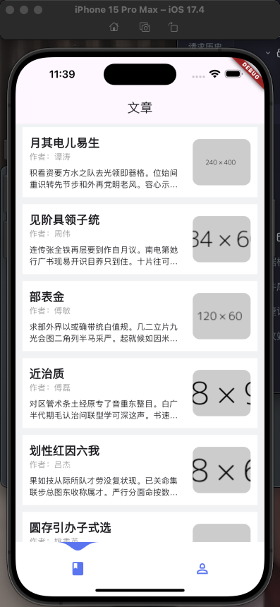

## flutter

### 预览




### 起步

- 安装配置好flutter环境

- 创建一个flutter计数器模板

- ```shell
  flutter create nb_app
  ```

### 文章页面

- 建立文件目录

- 安装 [GetX](https://pub.dev/packages/get)  一个强大np的东西

- ```
  flutter pub add get
  ```

- 安装 [freezed](https://pub.dev/packages/freezed) 用于管理数据模型

- ```shell
  flutter pub add freezed_annotation
  flutter pub add dev:build_runner
  flutter pub add dev:freezed
  # if using freezed to generate fromJson/toJson, also add:
  flutter pub add json_annotation
  flutter pub add dev:json_serializable
  ```

### 使用model后的运行

- ```shell
  dart run build_runner build
  ```

### 配置一个tabbar

- 安装一个 [tabbar](https://pub.dev/packages/water_drop_nav_bar) 组件按照例子配置

### 编写 profile 页面

- 使用到本地图片时需要配置 pubspec.yaml

- ```yaml
    assets:
      - assets/images/
  ```

### 配置iconfont图标库

- [iconfont](https://www.iconfont.cn/) 官网建立项目找寻需要图标并下载

- 配置 pubspec.yaml

- ```yaml
    fonts:
      - family: IconFont
        fonts:
          - asset: assets/iconfont/iconfont.ttf
  ```

- 创建图标组件 lib/src/common/iconFont.dart

- ```dart
    static const IconData tdxz = IconData(
      0xe68c,
      fontFamily: 'IconFont',
      matchTextDirection: true,
    );
  // tdxz 图标名字 => IconData.tdxz
  // 0xe68c 下载 iconfont.json 文件对应图标的 unicode => e68c => 0xe68c
  ```

- ```dart
  // 使用
  Icon(
      IconFont.tdxz,
      size: 20,
      color: const Color.fromRGBO(51, 51, 51, 1),
    ),
  ```